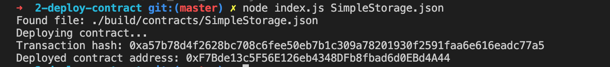

1. A screenshot of the console output immediately after you have successfully deployed a smart contract.

2. The transaction hash from the contract deployment (in text format).
`0xa57b78d4f2628bc708c6fee50eb7b1c309a78201930f2591faa6e616eadc77a5`

3. The deployed contract address from the contract deployment (in text format).
`0xF7Bde13c5F56E126eb4348DFb8fbad6d0EBd4A44`
